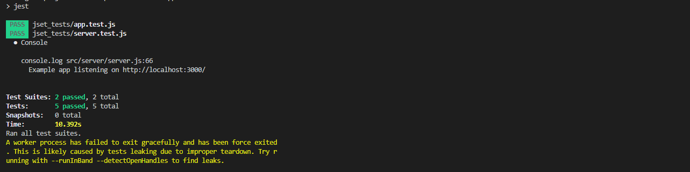

# Travel Planner - FEND Capstone Project

## Table of Contents
* [Project Summary](#project-summary)
* [API used](#api-used)
* [File Structure](#file_structure)
* [How TO Run This Project](#how-to-run-this-project)
* [Offline Functionality](#offline_functionality)
* [Testing](#testing)

## Project Summary

This is a travel planner application. This project includes a simple form where you enter the location you are traveling to and the date you are leaving. If the trip is within a week, you will get the current weather forecast. If the trip is in the future, you will get a predicted forecast. The OpenWeather API is fantastic but it doesn’t let you get future data for free and it’s not that flexible with what information you enter; we are going to use the Weatherbit API for you to see how another API accomplishes the same goals. Weatherbit API has one problem, it only takes in coordinates for weather data -- it’s that specific. So, we’ll need to get those coordinates from the Geonames API. Once we have all of this data, we’ll want to display an image of the location entered; for this, we will be using the Pixabay API.

## APIs used
 * [Geonames](http://www.geonames.org/export/web-services.html)
 * [Weatherbit](https://www.weatherbit.io/account/create)
 * [Pixabay](https://pixabay.com/api/docs/)

## File Structure
The project has the following file structure
    
    - dist/
    - jset_tests/
        - app.test.js
    - node_modules/
    - src/
        - client/
            - js/
                - application.js
                - to_do_list.js
            - media/
                - assets/
                    - weather-icons/
            - styles/
            - views/
                - index.html
            - index.js
        
        - server/ 
            - server.js

    - .babelrc
    - .gitignore
    - package-lock.json
    - package.json
    - process.env
    - README.md
    - REQUIREMENTS.md
    - screenshot_for_tests.png
    - webpack.dev.js
    - webpack.prod.js

## How TO Run This Project
1. Download/Clone this repository
2. cd into the new folder and Install all dependancies
    * put `npm install` on the terminal
3. to run the server in the production mode and create dist folder
    * `npm run build-prod` on the terminal
4. To start the server by 
    * Put `npm start` in the terminal
    * This project is running on: http://localhost:3000/

## Offline Functionality

The project have service workers set up in webpack.

## Testing
The project has Jest installed and can be run using `npm run test`

