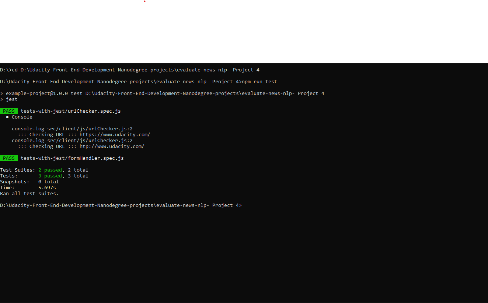

# Evaluate News with NLP - FEND Project 4

## Table of Contents
* [Project Summary](#project-summary)
* [API used](#api-used)
* [File Structure](#file_structure)
* [How TO Run This Project](#how-to-run-this-project)
* [Offline Functionality](#offline_functionality)
* [Testing](#testing)

## Project Summary

This Project is a web tool that allows users to run Natural Language Processing (NLP) on articles or blogs found on other websites.It will give us back pertinent information about the article, like whether the content is subjective (opinion) or objective (fact-based) and whether it is positive, neutral, or negative in tone.

### About NLP
> Natural language processing (NLP) is a subfield of computer science, information engineering, and artificial intelligence
concerned with the interactions between computers and human (natural) languages, in particular how to program computers to
process and analyze large amounts of natural language data.

## API used
 [Aylien API](https://aylien.com/) is a new Text Analysis API of Natural Language Processing (NLP) where you can send a link or a text to the API and the API will analyse the text and respond with information from textual content.

## File Structure
The project has the following file structure
    
    - dist/
    - src/
        - client/
            - js/
                - formHandler.js
                - urlChecker.js
            - styles/
            - views/
                - images/
                - index.html
            - index.js
        
        - server/ 
            - index.js
            - mockAPi.js

    - tests-with-jest/
        - formHandler.spec.js
        - urlChecker.spec.js
    
    - .babelrc
    - .gitignore
    - package-lock.json
    - package.json
    - process.env
    - README.md
    - REQUIREMENTS.md
    - screenshot_for_tests.png
    - webpack.dev.js
    - webpack.prod.js

## How TO Run This Project
1. Download/Clone this repository
2. cd into the new folder and Install all dependancies
    * put `npm install` on the terminal
3. to run the server in the production mode and create dist folder
    * `npm run build-prod` on the terminal
4. For using Aylien Api, Sign Up [here](https://developer.aylien.com/signup) to get your own API KEY & ID 
    * Create a `.env` file that contain your `API_ID` and your `API_KEY`
5. To start the server by 
    * Put `npm start` in the terminal
    * This project is running on: http://localhost:3000

## Offline Functionality

The project have service workers set up in webpack.

## Testing
The project has Jest installed and can be run using `npm run test`

